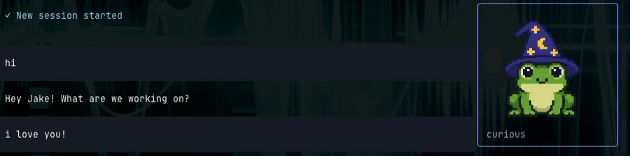

# Pi Pal

Give [Pi](https://github.com/earendil-works/pi) a little pixel-art pal. Pick a character, and it hangs out in your terminal, reacting to your conversation with animated expressions.



## Install

```sh
pi install git:github.com/jakekaplan/pi-pal
```

Set your default avatar:

```text
/pi-pal default frog with a wizard hat
```

Make it a robot, a sleepy cat, or whatever you like. Setting an avatar turns on automatic reactions to Pi's replies.

## Models

Sign in with `/login openai-codex`. Your account needs access to both models Pi Pal uses:

- **GPT-5.6 Luna** (`gpt-5.6-luna`) chooses your pal's reactions.
- **GPT Image 2** (`gpt-image-2`) draws your pal's animations.

Your main Pi conversation can use a different model. You'll also need a terminal with image support to see your pal animate.

## Use

Your pal reacts automatically as you chat, but you can also ask it to do something. It starts with 30 actions, including `happy`, `thinking`, `celebrating`, and `waving`. Try `/pi-pal waving` to say hello.

Describe what you want, like `/pi-pal do a little dance`. Pi Pal boils your request down to a specific action and tries to match one it already knows. If nothing fits, it adds a new custom action to use now and remember for later. It does the same when choosing reactions to the conversation.

| Command | Action |
| --- | --- |
| `/pi-pal` | Change your avatar, corner, and other settings |
| `/pi-pal happy` | Make your pal look happy |
| `/pi-pal do a little dance` | Request a custom action |
| `/pi-pal stop` | Hide your pal and pause automatic reactions |
| `/pi-pal on` | Turn automatic reactions back on |

## Settings and saved animations

Your pal is saved across sessions and projects. By default, its files live in `~/.pi/agent/`:

| File or folder | What's saved |
| --- | --- |
| `pi-pal.json` | Your avatar, corner, and automatic reaction preference |
| `pi-pal/custom-emotions.json` | Custom actions your pal has learned |
| `pi-pal/sprites/` | Generated images and animation frames |

If you've set a custom Pi agent directory, the files live there instead.

The first time your pal performs an action, it generates an animation. After that, it reuses the saved animation for the same avatar and action, including in future sessions. Repeating an action doesn't need another image-generation request; automatic reactions still use Luna to choose the action.

Changing your avatar clears its old animations. To start fresh without changing your pal, open `/pi-pal` and choose **Clear cached images…**. You can also reset custom emotions there.
